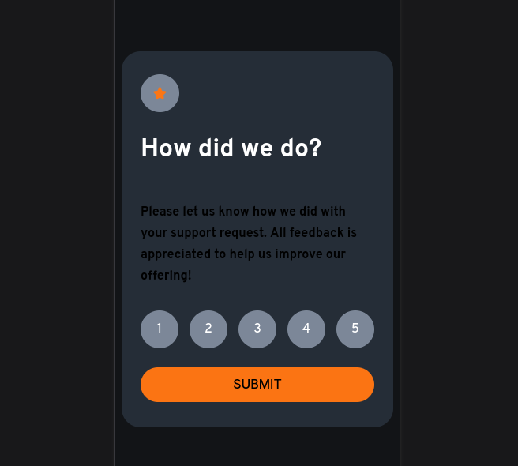
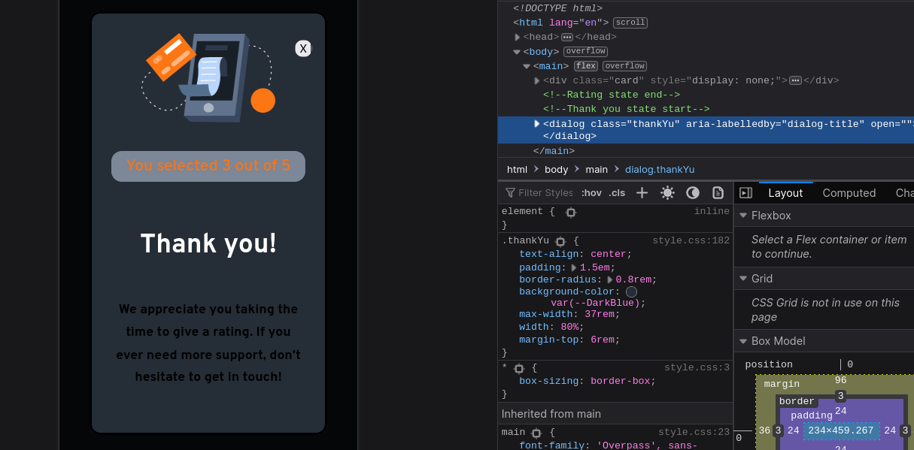

## Interactive rating component

### Links

-  [Solution URL](https://github.com/Edsonromeumaier/Rating-component)
-  [Live Site URL](https://rating-component-zeta-one.vercel.app/)

## Recomendações de acessibilidade web
**Referência:**

Essa solução foi inspirada pelo artigo: [Construindo uma modal semântica com o elemento &lt;dialog&gt;](https://dev.to/sucodelarangela/construindo-uma-modal-semantica-com-o-elemento-1j88), escrito por [Angela Caldas](https://dev.to/sucodelarangela). Publicado em maio de 2023.

Recomendamos fortemente a leitura desse artigo para obter insights valiosos sobre como tornar o seu projeto mais acessível. A autora aborda temas importantes relacionados à estruturação correta do HTML, fornecendo orientações práticas para alcançar a acessibilidade.

